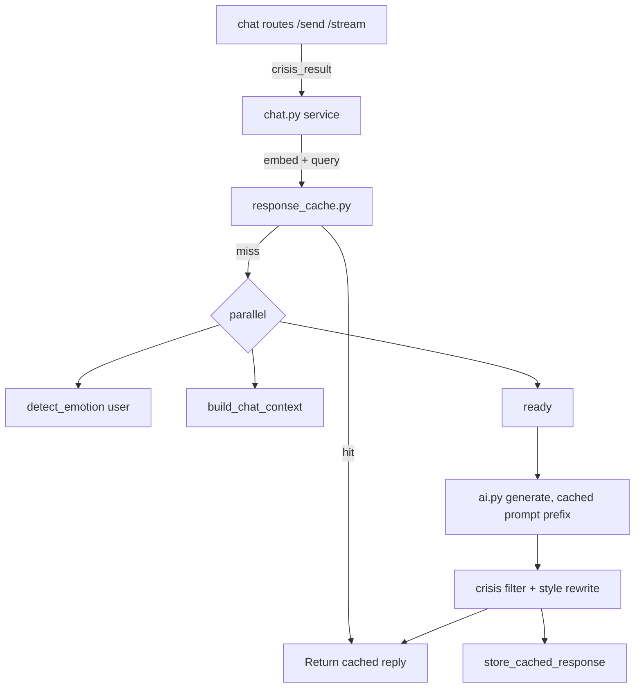

# Requirements

### Overview & Goals
Add a **semantic response cache** as a new AI-engineering capability and **reduce chat latency** by parallelizing the per-turn pipeline and enabling **prompt caching** — all on the FastAPI backend, with no frontend changes.

The goal is faster, cheaper chat turns for Sathi without changing the user-facing API contract (`/api/v1/chat/send` and `/api/v1/chat/stream` keep the same request/response shapes).

### Scope
**In scope**
- New per-user semantic response cache backed by a dedicated Pinecone namespace.
- Cache lookup (skip LLM on near-duplicate messages) and cache write-back after generation.
- Parallelizing the chat pipeline (crisis + emotion + context build) and removing the duplicate `detect_crisis` call between the route and the service.
- Prompt-caching-friendly restructuring of the system prompt in `app/services/ai.py`.
- New tunable settings in `app/core/config.py`.

**Out of scope**
- Frontend / `src/lib/api.ts` and chat UI changes.
- Model routing, RAG quality changes, async background post-processing (not selected).
- Database schema/migrations.

### User Stories
- As a user, when I send a message similar to one I asked before, I get an **instant reply** without waiting for the LLM.
- As a user, my chat replies start streaming **sooner** because crisis/emotion/context work happens in parallel.
- As an operator, repeated questions cost **fewer tokens** thanks to caching and prompt-cache reuse.

### Functional Requirements
- On each non-crisis turn, the backend embeds the user message and queries the per-user `response-cache` Pinecone namespace; on a hit above the similarity threshold it returns the cached reply (flagged via `model_used`, e.g. `cache`) and skips LLM generation.
- On a cache miss, generation proceeds as today and the final (post-filter/rewrite) reply is written back to the cache.
- Crisis turns are **never** cached or served from cache.
- The cache is per-user (filtered by `user_id`) so replies never leak across users.
- If Pinecone is unavailable, the system silently falls back to normal generation (no errors surfaced to the user).

### Non-Functional Requirements
- No change to the public chat request/response schema.
- All new external calls are time-bounded (reuse `EMBEDDING_TIMEOUT_SECONDS`) and fail open.
- Cache and parallelization must preserve existing crisis-safety and style-rewrite guarantees.

# Technical Design

### Current Implementation
The chat pipeline lives in `backend/app/services/chat.py` (`send_chat_message`, `send_chat_message_stream`) and runs largely **sequentially** per turn:
1. `detect_crisis(message)` — also called **again** in `app/api/chat/routes.py` before the service (duplicate work).
2. `detect_emotion(message)` — Hugging Face API, `timeout=30s`, blocking.
3. `build_chat_context(...)` (`chat_context.py`) — already internally parallel (`asyncio.gather`, 5s) but runs *after* emotion.
4. `generate_chat_response_with_usage(...)` (`ai.py`).
5. `filter_unsafe_assistant_response` + optional **second full LLM call** via `rewrite_chat_response_with_usage`.
6. `detect_emotion(ai_response)` — another blocking HF call before persisting/`done`.

`ai.py` builds messages in `_build_messages`, concatenating the large static `SYSTEM_PROMPT` with dynamic `MODE_INSTRUCTIONS`, language, and `user_context` into a **single system message**, so the cacheable prefix changes every turn. Token usage already surfaces `cache_tokens` via `_extract_token_usage`.

Embeddings already exist in `app/services/memory.py` (`generate_embedding`, OpenAI `text-embedding-3-small` with HF fallback), and a Pinecone index is injected via `get_pinecone_index`.

### Key Decisions
- **Cache storage: Pinecone namespace** `response-cache` (confirmed). Reuses `generate_embedding` and the injected `pinecone_index`; no new infra.
- **Cache scope: per-user** (confirmed) — every query/upsert filters on `user_id`; crisis turns excluded.
- **Dedupe crisis detection**: compute `detect_crisis` once in the route and pass the result into the service (new optional param) to avoid the double call.
- **Parallelize**: run independent steps (`detect_emotion(user)`, `build_chat_context`, cache lookup) concurrently with `asyncio.gather`; keep crisis as the cheap, fast short-circuit guard.
- **Prompt caching**: split the static `SYSTEM_PROMPT` into its own leading system message (byte-identical every turn) and push dynamic mode/language/context into separate later messages so providers can reuse the cached prefix.

### Proposed Changes
**1. New `backend/app/services/response_cache.py`**
- `async def lookup_cached_response(user_id, message, pinecone_index) -> str | None` — embed message, `pinecone_index.query(..., namespace=RESPONSE_CACHE_NAMESPACE, filter={"user_id": user_id})`; return cached `reply` metadata when top score >= `RESPONSE_CACHE_SIMILARITY_THRESHOLD`.
- `async def store_cached_response(user_id, message, reply, pinecone_index) -> None` — embed + `upsert` into the namespace with metadata `{user_id, query, reply}`; time-bounded by `EMBEDDING_TIMEOUT_SECONDS`; fail open.
- Guarded by `RESPONSE_CACHE_ENABLED`; all exceptions logged and swallowed.

**2. `app/services/chat.py`**
- Add optional `precomputed_crisis` param to `send_chat_message` / `send_chat_message_stream`; skip internal `detect_crisis` when provided.
- After persisting the user message (non-crisis), call `lookup_cached_response`; on hit, persist an assistant message with `model_used="cache"` and return/stream it directly (stream emits the cached text as one `chunk` then `done`).
- On miss, run `detect_emotion(user)` + `build_chat_context` concurrently via `asyncio.gather`, then generate as today; after the final reply is computed (post-filter/rewrite), call `store_cached_response`.

**3. `app/api/chat/routes.py`**
- Pass the already-computed `crisis_result` into the service via `precomputed_crisis` in both `/send` and `/stream`.

**4. `app/services/ai.py`**
- In `_build_messages`, emit the static `SYSTEM_PROMPT` as a dedicated first system message and append dynamic parts (mode, language, user context, summary) as subsequent messages, keeping the cache prefix stable.

**5. `app/core/config.py`**
- Add `RESPONSE_CACHE_ENABLED: bool = True`, `RESPONSE_CACHE_NAMESPACE: str = "response-cache"`, `RESPONSE_CACHE_SIMILARITY_THRESHOLD: float = 0.95`.

### Data Models / Contracts
Pinecone cache vector metadata:
```json
{ "user_id": "<uuid>", "query": "<original message>", "reply": "<assistant reply>" }
```
No change to `ChatRequest` / `ChatResponse` schemas. Cached replies are indicated only by `model_used="cache"`.

### Architecture Diagram


### Risks
- **Stale/over-eager cache hits** → keep threshold high (0.95) and per-user; exclude crisis; easy to disable via flag.
- **Embedding latency on lookup** could offset savings → bound by `EMBEDDING_TIMEOUT_SECONDS` and fail open to generation.
- **Prompt-cache reuse depends on provider** (HF Router/groq/novita) → restructuring is still beneficial for token accounting and is safe if unsupported.

# Testing

### Validation Approach
Backend-only validation via the existing test commands (`npm run test:backend` → `python -m compileall app` + `pytest`) plus targeted unit tests for the new cache service. All new external calls must fail open, so tests run without live Pinecone/OpenAI by injecting a fake index.

### Key Scenarios
- **Cache miss then hit**: first message generates via LLM and writes back; a near-identical follow-up returns the cached reply with `model_used="cache"` and makes no LLM call.
- **Below threshold**: a loosely related message does **not** hit the cache and generates normally.
- **Per-user isolation**: user B never receives user A's cached reply (filter on `user_id`).
- **Crisis bypass**: crisis messages are neither served from nor written to the cache and still return the safety template.
- **Parallel pipeline parity**: a non-crisis turn still persists user+assistant messages, emotion, and token usage identically to before.

### Edge Cases
- Pinecone index is `None`/raises → lookup returns `None`, store is a no-op, generation proceeds.
- `RESPONSE_CACHE_ENABLED=false` → cache fully bypassed.
- Embedding timeout → fail open without raising to the route.
- Streaming path: cached hit emits a single `chunk` + `done`; miss still streams chunks and applies rewrite/filter as today.

### Test Changes
- Add `backend/tests` unit tests for `response_cache.lookup_cached_response` / `store_cached_response` using a fake Pinecone index (hit, miss, error/fallback, per-user filter).
- Add a chat-service test asserting `precomputed_crisis` prevents a second `detect_crisis` call and that a cache hit short-circuits generation.

# Delivery Steps

### ✓ Step 1: Add semantic response cache service and settings
A new per-user Pinecone-backed response cache module exists and is configurable.

- Create `backend/app/services/response_cache.py` with `lookup_cached_response(user_id, message, pinecone_index)` and `store_cached_response(user_id, message, reply, pinecone_index)`.
- Reuse `generate_embedding` from `app/services/memory.py`; query/upsert the `response-cache` namespace filtered by `user_id`.
- Return a hit only when the top similarity score ≥ `RESPONSE_CACHE_SIMILARITY_THRESHOLD`; bound calls by `EMBEDDING_TIMEOUT_SECONDS` and swallow/log all errors (fail open).
- Add `RESPONSE_CACHE_ENABLED`, `RESPONSE_CACHE_NAMESPACE`, `RESPONSE_CACHE_SIMILARITY_THRESHOLD` to `app/core/config.py`.

### ✓ Step 2: Integrate cache lookup and write-back into the chat pipeline
Non-crisis chat turns serve cached replies on a hit and populate the cache on a miss.

- In `app/services/chat.py` (`send_chat_message` and `send_chat_message_stream`), after persisting the user message, call `lookup_cached_response`.
- On a hit, persist an assistant message with `model_used="cache"` and return it (stream emits the cached text as one `chunk` then `done`), skipping LLM generation.
- On a miss, after the final post-filter/post-rewrite reply is computed, call `store_cached_response`.
- Never cache or serve crisis turns.

### ✓ Step 3: Parallelize the pipeline and dedupe crisis detection
The per-turn pipeline runs independent work concurrently and detects crisis only once.

- Add an optional `precomputed_crisis` parameter to the chat service functions and pass `crisis_result` from `app/api/chat/routes.py` (`/send` and `/stream`) so `detect_crisis` is not called twice.
- Run `detect_emotion(user message)`, `build_chat_context(...)`, and the cache lookup concurrently via `asyncio.gather`, keeping crisis as the fast short-circuit guard.
- Preserve existing persistence of emotion, token usage, summaries, and the streaming event sequence.

### ✓ Step 4: Make the system prompt prompt-cache friendly
The static system prompt forms a stable, cacheable prefix to cut input-token cost per turn.

- In `app/services/ai.py` `_build_messages`, emit the static `SYSTEM_PROMPT` as its own leading system message kept byte-identical across turns.
- Move dynamic `MODE_INSTRUCTIONS`, language context, `user_context`, and summary into separate subsequent messages.
- Verify `cache_tokens` continue to be captured via `_extract_token_usage` and that streaming/non-streaming outputs are unchanged.