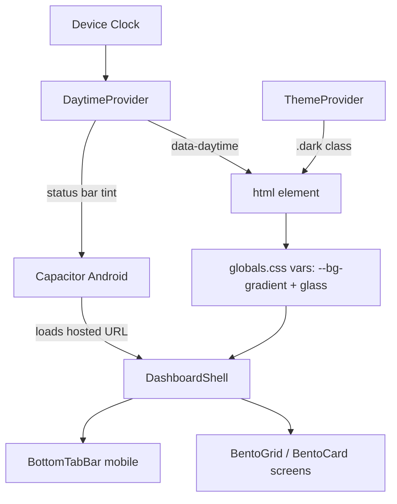

# Requirements

### Overview & Goals
Modernize the **Sathi/Sereni** wellness app (Next.js 16 / React 19 / Tailwind 4) with an optimized **bento-grid + glassmorphism** visual language across all screens, introduce **time-of-day gradient themes** (morning / noon / afternoon / night) that switch automatically by the device clock, and package the app as an **installable Android app via Capacitor**.

The app already has foundations to build on: a `.glass-card` utility system in `globals.css`, a bento grid on `/dashboard`, a green palette with light/dark modes, and `framer-motion` animations. This effort refines and unifies those into a polished, app-like experience and ships it to Android.

### Scope
**In Scope**
- Refine glassmorphism + bento grid across **all app screens**: dashboard, mood, sleep, habits, journal, ai-companion, insights, resources, settings, profile, subscription, admin.
- Time-of-day gradient background system (morning/noon/afternoon/night) layered **orthogonally** on top of the existing light/dark mode, selected automatically from the device clock.
- App-like mobile experience: glass **bottom tab bar** for primary navigation, larger touch targets, safe-area handling.
- Capacitor Android wrapper producing an installable APK/AAB, plus app icon, splash, and status-bar theming.

**Out of Scope**
- Backend/API changes (Python backend untouched).
- New product features or data models.
- iOS packaging (structure stays compatible but not delivered).
- Auth/business-logic rewrites.

### User Stories
- As a user, I want a clean, modern bento layout with frosted-glass cards so the app feels premium and easy to scan.
- As a user, I want the background to shift with the time of day (sunrise warmth in the morning, calm blues at night) so the app feels alive and matches my mood.
- As a mobile user, I want a bottom tab bar and comfortable touch targets so the app feels native on my phone.
- As an Android user, I want to install the app from an APK and have it open full-screen with a branded splash and themed status bar.

### Functional Requirements
- All primary content cards use a consistent glass treatment (blur, border, radius, shadow, hover lift) via shared components/utilities.
- Each screen uses a responsive bento grid (varied column spans) that collapses gracefully to a single column on mobile.
- A time-of-day engine resolves the current period from local time and exposes it app-wide; the page background and accent tints update accordingly, with smooth transitions and no SSR hydration flash.
- Time-of-day works in both light and dark mode (it tints the background gradient; it does not override the light/dark choice).
- On mobile, a glass bottom tab bar exposes primary destinations; the existing drawer remains for secondary items; safe-area insets are respected.
- The Android build loads the app, respects notches/safe areas, shows a branded splash, and themes the status/navigation bars to match the active time-of-day gradient.

### Non-Functional Requirements
- No regressions to `npm run lint`, `npm run typecheck`, or `npm run build`.
- Maintain existing i18n (en/bn) and accessibility (aria labels, focus states, reduced-motion respect).
- Backdrop-filter usage kept performant (avoid excessive stacked blurs on low-end Android).

# Technical Design

### Current Implementation
- **Styling system**: `src/app/globals.css` defines CSS variables under `:root` and `.dark`, glass utilities (`.glass-card`, `.glass-card-strong`), gradient/glow/hover utilities, and a static body gradient (lines 166-205). Tailwind 4 with `@theme inline` token mapping.
- **Theming**: `src/components/theme-provider.tsx` manages `light | dark | system`, toggling the `.dark` class on `<html>` and persisting to `localStorage` (`Sathi-theme`). Hydration handled via `useSyncExternalStore`.
- **Layout**: `src/app/layout.tsx` wraps the app in `AuthProvider > I18nProvider > ThemeProvider`. `src/components/layout/dashboard-shell.tsx` renders desktop `Sidebar`, `MobileSidebar` (top bar + slide-in drawer), `Header`, and animated content.
- **Bento grid**: `src/app/dashboard/page.tsx` uses a `grid-cols-12` bento with `col-span` widgets from `src/components/widgets/*`. Shared glass card components exist at `src/components/shared/glass-card.tsx` and `src/components/ui/GlassCard.tsx`.
- **Mobile nav**: `src/components/layout/mobile-sidebar.tsx` defines `userNavigation` items and a top glass header + drawer.

### Key Decisions
1. **Time-of-day as an orthogonal layer** (user-confirmed): add a `data-daytime` attribute on `<html>` (`morning|noon|afternoon|night`) driving a dedicated set of CSS variables for the page background gradient and accent tints. Light/dark stays the source of truth for component palettes; daytime only retints the ambient background. This avoids combinatorial palette explosion.
2. **Auto selection by device clock** (user-confirmed): a small provider computes the period from `new Date().getHours()` and re-evaluates on an interval / focus; no manual override UI.
3. **Capacitor wrapper for Android** (user-confirmed): introduce a Capacitor project (`android/` + `capacitor.config.ts`). Because the app relies on next-auth and Next API routes, the wrapper loads the **hosted production URL** (server config) rather than a static export — this preserves all server behavior with minimal change. (Static-export alternative noted under Risks.)
4. **Glass bottom tab bar for mobile** (user-confirmed): new component shown on `lg:hidden`, drawer retained for secondary links.
5. **Consolidate glass components**: standardize on one shared `GlassCard` and a new `BentoGrid`/`BentoCard` primitive so every screen shares identical styling and animation.

### Proposed Changes
**1. Time-of-day theming engine**
- Add `src/components/daytime-provider.tsx`: resolves period from local time using `useSyncExternalStore` (mirroring `theme-provider.tsx` to avoid hydration flash), sets `document.documentElement.dataset.daytime`, and re-checks periodically.
- Mount it inside `ThemeProvider` in `src/app/layout.tsx`.
- In `globals.css`, add `[data-daytime='morning'|'noon'|'afternoon'|'night']` blocks defining `--bg-gradient` (and subtle accent tint vars) for both base and `.dark`; refactor the body background (lines 170-178) to consume `--bg-gradient` with a `transition` for smooth period changes; respect `prefers-reduced-motion`.

**2. Bento + glass design system**
- Add `src/components/shared/bento-grid.tsx` exporting `BentoGrid` and `BentoCard` (configurable col/row span, glass styling, motion-in, hover lift) building on existing `.glass-card` utilities.
- Refine glass utilities in `globals.css` (consistent radius, border, layered shadow, optional inner highlight) and reconcile the two existing glass card files into one canonical component.
- Migrate each route's content grid to `BentoGrid`/`BentoCard`: dashboard, mood, sleep, habits, journal, ai-companion, insights (`InsightsContent` / `OverviewGrid` / `AdvancedGrid`), resources, settings (`SettingsGrid`), profile, subscription, admin.

**3. Mobile app-like navigation**
- Add `src/components/layout/bottom-tab-bar.tsx`: glass bar with primary destinations (Dashboard, Mood, Journal, Insights, AI Companion) using the same icon set as `mobile-sidebar.tsx`; active-state highlight; `pb-[env(safe-area-inset-bottom)]`.
- Render it from `dashboard-shell.tsx` (`lg:hidden`); add bottom padding to `<main>` so content clears the bar; keep drawer for overflow items.

**4. Android packaging (Capacitor)**
- Add `capacitor.config.ts` (appId, appName, `server.url` → hosted deployment, scheme), `@capacitor/core`, `@capacitor/cli`, `@capacitor/android`, `@capacitor/status-bar`, `@capacitor/splash-screen` to `package.json`.
- Generate the `android/` native project; add app icon + splash assets in `public/` / resources.
- Use the Status Bar plugin to tint the bar to match the active daytime gradient; configure splash background.
- Document build commands (`npx cap sync`, open in Android Studio / `gradlew assembleRelease`). Consult `node_modules/next/dist/docs/` for any export/runtime caveats before wiring config.

### Data Models / Contracts
```ts
// daytime-provider.tsx
export type Daytime = 'morning' | 'noon' | 'afternoon' | 'night';
export function useDaytime(): { daytime: Daytime };
// morning 5–11, noon 11–15, afternoon 15–19, night 19–5

// bento-grid.tsx
interface BentoCardProps { colSpan?: number; rowSpan?: number; className?: string;
  glowOnHover?: boolean; delay?: number; children: React.ReactNode; }
```
```css
/* globals.css */
[data-daytime='morning'] { --bg-gradient: linear-gradient(135deg,#FFE8C7 0%,#FFD9A0 50%,#FFF3E0 100%); }
[data-daytime='night']   { --bg-gradient: linear-gradient(135deg,#0E1430 0%,#1A2150 50%,#10162E 100%); }
body { background: var(--bg-gradient); transition: background 1.2s ease; }
```

### Components
- **New**: `DaytimeProvider` / `useDaytime`, `BentoGrid`, `BentoCard`, `BottomTabBar`.
- **Modified**: `layout.tsx` (mount provider), `dashboard-shell.tsx` (bottom bar + padding), `globals.css` (daytime vars, refined glass), all route `page.tsx` grids and grid components (`OverviewGrid`, `AdvancedGrid`, `SettingsGrid`).
- **Consolidated**: `shared/glass-card.tsx` + `ui/GlassCard.tsx` → single canonical card.

### File Structure
```
src/components/daytime-provider.tsx        (new)
src/components/shared/bento-grid.tsx       (new)
src/components/layout/bottom-tab-bar.tsx   (new)
src/app/globals.css                        (modified)
src/app/layout.tsx                         (modified)
src/components/layout/dashboard-shell.tsx  (modified)
src/app/**/page.tsx                        (modified grids)
capacitor.config.ts                        (new)
android/                                   (new, generated)
```

### Architecture Diagram


### Risks
- **backdrop-filter performance** on low-end Android: cap blur radius, avoid deeply nested glass; test on device.
- **Capacitor + server features**: static export is incompatible with next-auth/API routes, so the wrapper loads the hosted URL; offline use is limited (acceptable for v1). Static-export + remote-API is the documented alternative if a fully bundled app is later required.
- **Hydration flash** for daytime/theme: mitigated by `useSyncExternalStore` pattern already used in `theme-provider.tsx`.
- **Two existing glass card components** diverging: consolidation must update all import sites.

# Testing

### Validation Approach
Verify visual/behavioral correctness through static checks and the existing build pipeline, plus targeted manual inspection in the dev server and the Android shell. No backend changes, so backend tests are unaffected.

### Key Scenarios
- `npm run lint`, `npm run typecheck`, and `npm run build` all pass after each stage.
- Dashboard and every migrated screen render the bento grid correctly at mobile, tablet (`sm`), and desktop (`lg`) breakpoints; cards keep consistent glass styling and hover lift.
- Setting the device/local clock to each period yields the correct `data-daytime` value and the expected background gradient in both light and dark mode.
- The mobile bottom tab bar appears below `lg`, highlights the active route, navigates correctly, and clears safe-area insets; the drawer still opens for secondary items.
- Capacitor build (`npx cap sync` + Android Studio/gradle) produces an installable APK that opens full-screen with branded splash and a status bar tinted to the active gradient.

### Edge Cases
- Period boundary times (e.g., 04:59 vs 05:00) resolve to the correct daytime; transition is smooth, not abrupt.
- `prefers-reduced-motion` disables gradient/card transition animations.
- No hydration mismatch warnings on first paint (SSR vs client) for theme + daytime attributes.
- i18n (en/bn) layouts don't overflow in the new bento cards or bottom bar.
- Notched / gesture-nav Android devices render content without overlap.

### Test Changes
- No automated UI tests exist; rely on lint/typecheck/build plus manual verification. Add none unless a lightweight unit test for the `getDaytime(hour)` pure function is warranted (small, recommended).

# Delivery Steps

### ✓ Step 1: Build the bento + glass design system foundation
Shared primitives and refined glass utilities exist and the dashboard uses them.

- Add `src/components/shared/bento-grid.tsx` exporting `BentoGrid` and `BentoCard` (configurable col/row span, glass styling, framer-motion entrance, hover lift).
- Consolidate `src/components/shared/glass-card.tsx` and `src/components/ui/GlassCard.tsx` into one canonical component and update import sites.
- Refine glass utilities in `src/app/globals.css` (consistent radius, border, layered shadow, optional inner highlight).
- Migrate `src/app/dashboard/page.tsx` to `BentoGrid`/`BentoCard` as the reference implementation.
- Verify `npm run lint`, `typecheck`, and `build` pass.

### ✓ Step 2: Implement the time-of-day gradient theming engine
Background gradient and accent tints switch automatically by device clock, layered over light/dark.

- Add `src/components/daytime-provider.tsx` with `useDaytime` and a pure `getDaytime(hour)` helper (morning/noon/afternoon/night), using the `useSyncExternalStore` pattern from `theme-provider.tsx` to avoid hydration flash; set `document.documentElement.dataset.daytime` and re-evaluate periodically/on focus.
- Mount the provider inside `ThemeProvider` in `src/app/layout.tsx`.
- In `globals.css`, add `[data-daytime=...]` blocks defining `--bg-gradient` + accent tints for base and `.dark`, refactor the body background to consume `--bg-gradient` with a smooth transition, and respect `prefers-reduced-motion`.
- Manually verify each period in light and dark mode.

### * Step 3: Roll out bento + glass redesign across all remaining screens
Every app screen uses the unified bento-grid + glass system responsively.

- Migrate route grids to `BentoGrid`/`BentoCard`: mood, sleep, habits, journal, ai-companion, resources, profile, subscription, admin.
- Update grid components: `src/app/insights/InsightsContent.tsx`, `components/insights/OverviewGrid.tsx`, `AdvancedGrid.tsx`, and `components/settings/SettingsGrid.tsx`.
- Ensure responsive column spans collapse to single column on mobile and preserve i18n (en/bn) without overflow.
- Confirm lint/typecheck/build stay green.

###   Step 4: Add app-like mobile navigation
A glass bottom tab bar provides primary navigation on mobile with safe-area handling.

- Add `src/components/layout/bottom-tab-bar.tsx`: glass bar with primary destinations (Dashboard, Mood, Journal, Insights, AI Companion) reusing the lucide icons from `mobile-sidebar.tsx`, active-state highlight, and `env(safe-area-inset-bottom)` padding.
- Render it (`lg:hidden`) from `src/components/layout/dashboard-shell.tsx` and add bottom padding to `<main>` so content clears the bar.
- Keep the existing drawer for secondary/overflow items; verify touch targets and active routing.

###   Step 5: Package the app for Android with Capacitor
An installable Android APK loads the app full-screen with branded splash and themed status bar.

- Add Capacitor deps (`@capacitor/core`, `@capacitor/cli`, `@capacitor/android`, `@capacitor/status-bar`, `@capacitor/splash-screen`) and `capacitor.config.ts` with `server.url` pointing to the hosted deployment (preserving next-auth/API routes); consult `node_modules/next/dist/docs/` for runtime caveats.
- Generate the `android/` native project and add app icon + splash assets.
- Wire the Status Bar plugin to tint the bar to the active daytime gradient and configure the splash background.
- Document build/run commands (`npx cap sync`, Android Studio / `gradlew assembleRelease`) and validate an installable APK.